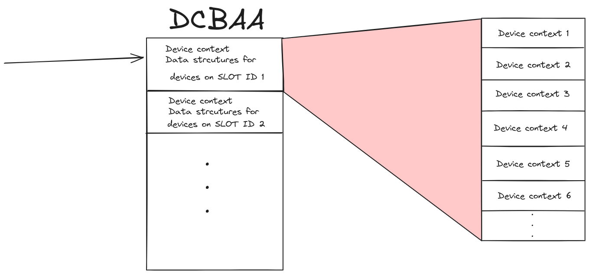
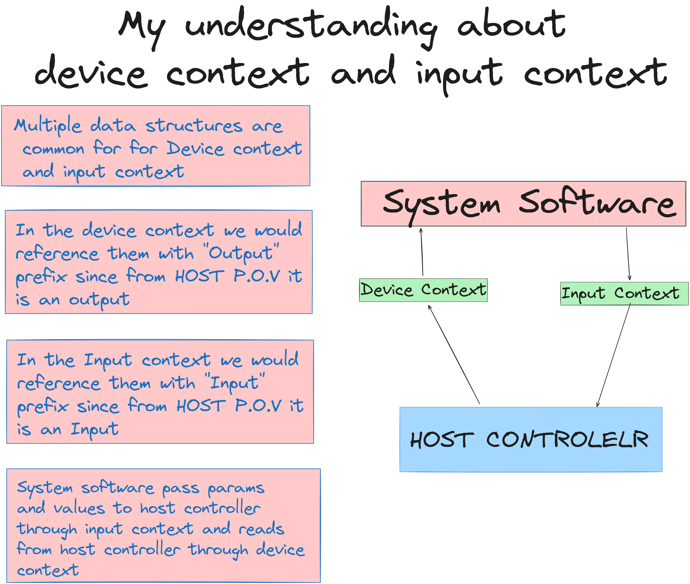

# xHCI Data Structure
xHCi is running on a virtual memory environment on the system. But there would be limitations to the this since continous data that needs to be transferred from host to device may not be aligned neighboring memories due to the laclk of enough space to accomodate the data. xHC data structers are dsigned t oaccomodate these sysytem limitations by either keeping the data structure under 4Kb, which is the minimum supported page size, or by using a mechanism to link multiple non-contagious blocks oof memmory to form larger logically continous data structures.

- Device context Base Address Array
- Device context
- Slot context
- Endpoint context
- Stream context array
- Stream context
- [Input context]()
- Input control context
- Rings
- Transfer Request Block
- Scatter/GAther transfers
- Control Transfers
- Bulk Interrupt transferrs
- Isoch transfers

## Device Context Base Address Array (DCBAA)

  This provides xHC with a slot ID based lookup table for accessing the device context data structures. When some devices are attached system sopftwaare initializes a device context data structure, and requests a slot id from xHC and inserts a pointer to the newly created device context into DCBAA at teh loccation indicated by the slot ID.

  

  Note: Slot ID 0 is reserved by xHCI scratchpad mechanism

  ## Device Context
  It is a n array of 32 data structures. It is manages by xHC and is used to report the state information and device configuration. The first context data structure , that is index 0, is a Slot context data structure. The remaining 31 data structures are endpoint context data structures.

  During enumeration of a USB device ,system software allocates a Device Context data structure **for device in the host memory** and initializes it to zero.Ownership of the Data structure is then passed to the xHC until the device is slot is disabled.And these data structures are readonly by system software while owned by xHC.

  ## Slot context
Slot context can be found in Device context data structure and Input context data structure.The information passed by the slot context are :
- Control 
- State
- Addressing
- power management

Since the slot context is available on 2 different datastructure (ie Device context and input context) it has different duties.
### Slot context on device context
Slot context is responsible for reporting the current state and parameters of  the device to system software. Slot context on Device on context  is also known as "Output Slot Context".

### Slot context on Input context
This data structure is used by the system software to pass command parameters to the host controller. If the command targeted at the device slot is successfull then xHC will update the Output Slot context to reflect parameter values. "Input slot context"

## Endpoint Context
Provides details about the state  and  parameters of endpoints. These data structures exist on both Input data context and device context. and on each context they have differnet roles. It has some fields that are helpful in debugging the transfer operations associated wit hthe pipe. And error counter (CErr) may be used to force unlimitted retries of USB transactions.

### Endpoint context on device context
When being referenced as a device context member the role of this is to report the current valus of endpoint related parameters to system software. in this context the endpoint context is also referenced as "Output Endpoint Context"

### Endpoint context on Input context
While being refernced as a input context member the role of enpoint context is t opass the endpoint related values from system software to xHC. also kanow ans Input Endpoint context

## Stream context array

If a USB3 endpoint supports streams ,transfer rings of such an endpoint would be defined by stream context array.

### Stream context
This data structure provides a pointer to the streams transfer ring.

## Input context
Used by system software to define device configurations and state informations that needs to be passed to xHC.

## Input control context
This is a set of two flags arranged as bit vector. They are known as Drop and Add flags. The interpretationon of these flags depends on the command being executed . But in general it is used to indicate which endpoints are affected by the command and how.

EX: If a usb host want to support a specific USB configuration , then it will have to follow the following steps:
- Software will initialize the Endpoint context data structures of an input context with  target endpoint configuration information. 
- then it will insert a configure endpoint command on the command ring that points to the input context
- And ring the host controller doorbell
The add flag in the input control context indicate that endpoint configuration needs to be added to the xHC valid list of endpoints
The drop flag in the input control context indicate that endpoint configuration needs to be removed from the xHC
valid list of endpoints (for more refer xHC 6.2.5.1)

## Rings
Rings ar circular queue of data structures. There are mainly 3 types of rings they are:
- Command ring
- Even ring
-  Transfer ring
-  
### Command ring
This rings are used by the system software to issue commands to the xHC. There is only one command ring and it is for the xhc
### Event ring
This rings are used by the xHC to report the response for a command to the system software. This rings are available one for each interrupter
### Transfer ring
This rings are used by the xHC to transfer data between the system memory  and the device end point.  There is one transfer ring for each endpoint

### Side note :what are interrupters ?
Interrupter managess events and their notifications to the host. The xHC can support upto 1024 interrupters . (Set using HCSPARAMS1). Each interrupter have its own *interrupt management register,interrupter moderation register and an event ring* . Each interrupter is mapped to an MSI interrupt vector. An interrupter will assert an interrupt if interupts are enabled and its associated event ring contains EVENT TRB that require an interrupt.

Interrupter mapping is the ability to target an interrupter and its even ring, wuith transfer events generated by speciifc transfer request block.

Interrupter moderation allows multiple events to be processed as a part of single Interrupt Service Request rather than one IRQ for each event.

## Transfer Request Block (TRB)
This is a data structure constructed in the memory by the system software to tranfer data between xHC memeory and device . These are single physically continous blocks of data. TRB can have Data buffer pointer,size of buffer,and some additional control information.

